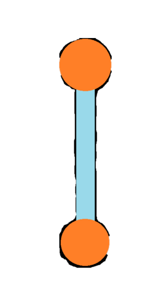

# Against All Odds Milestone Project

## Introduction

This repository represents my milestone project 2 for Code Institute. For this milestone project, I have created a 2D spaceship survival game built using JavaScript and HTML Canvas. Developed using vanilla JavaScript, no additional libraries were used. 
I have taken inspiration from a childhood video game called Geometry Wars, specifically a game mode called Pacifism.
As a child, I spend countless hours on this mode trying to beat my friend's high scores. The concept is simple, you don't have any projectiles so the only way to survive is to pass through gates in order to destroy nearby ships and to thin the ever increasing hoarde.
The goal is to survive for as long as possible. Similarly to other arcade games, there is no possible way to beat the game. You must simply try and survive for as long as you can.
Enemy speed increases when your score passes certain increments. This will be outlined to the user using custom sound effects.
Cusomisation has been implemented in this application, the user has the ability to change the background and game difficulty at the start screen. Local storage is then used to track user customisation in between sessions.

### Considerations 

Geometry Wars 2: Pacifism was released on traditional games consoles with a large amount of screen real estate & dedicated controller. 
While implementing the mobile version of this application, I have encountered several limitations that dramatically reduce the enjoyment one gets from playing this game.
In the start menu on desktop, the user is able to select their desired difficulty but for mobile I have decided to limit game speed to amateur. 
This is due to reduced time the player has to react to enemy sprites. Touch drag was selected to move the player sprite. 
At the early stages of design, this control method seemed like this best of a bad bunch, but it too lacks the necessary accuracy to play the game as intended.
In order to appreciate this game as it was intended, it is recommended to play this application on a desktop/laptop with a mouse.

## UX

### Project Goals

My main goal for this Code Institute milestone project was to authentically emulate a video game from my childhood (Geometry Wars 2: Pacifism) within the browser using vanilla JavaScript.
I also wanted to successfully capture the gameplay feeling from the original with learning about vanilla JavaScript & HTML5 canvas.

#### Player Goals

The target audience for this game is users of any age.

The player's goals are:

* That the game is fun to play & keeps me coming back to beat my high score.
* Controls that are intuitive & easy to learn.
* Sprite & Background designs that inspire emotion.
* Audio cues that outline specific game events.

Against All Odds has achieved these player needs by:

* Controls were designed with simplicity in mind while retaining the original game's gameplay feeling.
* The amount of buttons within the application have been kept to a minimum.
* Controlling the player sprite is done by simply moving the cursor to where you would like the user to travel (for mobile devices, this will be accomplished by dragging your finger across the screen).
* The user is notified of significant game events using audio cues.
* These audio cues occur at game start, game end & whenever a user successfully clears a gate.
* Making it easy to restart the game loop with minimal downtime by the click of a single button.

#### Developer & Business Goals

* The main developer goal for this project is to learn as much as possible about JavaScript & HTML5 canvas.
* Adding another project that the developer is passionate about to their portfolio.
* To create a well-designed application that is free of any bugs which would cause the user stop playing prematurely.
* To design a satisfying game loop that is fair to the player.

### User stories

1. As a user of this web application I want:

    - A satisfying game loop that keeps me coming back in order beat my high score.
    - Sound effects to let me know when important game events take place.
    - Sound design that doesn't get boring to listen to over time.
    - Consistent frame rate.
    - The ability to change the difficulty if needed.

2. As a games platform looking to add this application to their library I would want:

    - A great game loop that will keep our users hooked.
    - Sound design that doesn't get boring/annoying to the user over time.
    - Sprite designs that capture the user's imagination and generate an emotional response.

3. As a parent of a child user I would like:

    - A game free from gratuitous violence & profanity.
    - Sprites design that doesn't make the children scared.

### Sprites

When designing UX for a game, selecting the correct sprite image is essential as it can dramatically change the appearance & feel of your finished application.
For my search, I decided to browse several game development marketplaces to see which sprite images were available for free. 
As the theme of the game is science fiction, it naturally limited my search.

###### Player Sprite (Human Mining Station)

As mentioned above, the point and click method was chosen as user input. This introduced a UX issue that would look disconcerting to the end user. 
Depending on where the user clicked, the sprite would appear either upside down or at the incorrect angle. Due to this, circular sprite was chosen for the player.
This allows the sprite to appear the same, no matter the angle or direction of user input.

###### Enemy Sprite (Alien Drone Ship)

When choosing the enemy sprite, I wanted the design to give the user a sense of mortality and dread. The ship had to look like it belonged to a terrifying alien race hellbent on conquering human civilisation.
As the enemy sprites travel in hoards, the sprite design needed to look good with multiple sprites close together or overlapping.

###### Gate Sprite (Used to thin Alien horde)

This sprite was designed and created by myself using Microsoft Paint. 
The 2 orange circles at the edge of the sprite are deadly mines which end the game if touched. The user must pass through the center of the gate in order to clear the surrounding area of enemy sprites.

### Background

In 2D game development backdrops are often used to add depth, give context to the canvas & individual game elements. They provide something for the user's imagination to work with.
As this game is a 2D space arcade, the natural choice for background images would be horizons from outer space. Within the background image array, there are several images of different nebula & starry backdrops.

###### Default Background

As the default background, I have chosen an image of a horizon in the depth of outer space. It contains no planets or nebula, further emphasising the cold darkness of the battlefield that the user finds themselves in.

###### Background Array

This array is responsible for storing background image file names as strings. This array will later be used to cycle through different backdrops adding another element of user customisation.

### Sound

All sound effects & background tracks were recorded for this project by DJ green except the gem collected SFX which was sourced from a free game development marketplace

###### Bandcamp Player (Soundtrack)

At the start screen, the user is able to choose their soundtrack from an embedded Bandcamp playlist. 
All backing tracks have been produced by DJ Green. Expressed permission has been given for the use of all audio used in this project.

###### Game Start Sound Effect

When the user starts or restarts the game, this sound effect will be played to let the user know it's game time.

###### Gate Destruction Sound Effect

This sound effect was custom-made to provide the user with aural feedback whenever a gate is successfully destroyed. When choosing the sound design for this effect, we wanted to emmulate the sound of an explosion in space. 
It is well known that sound waves cannot travel through the vaccum of space, but this was our thought process when designing the sound effect.

###### Gem Collected Sound Effect

This sound effect was sourced from [freesound.org](https://freesound.org/) in order to provide feedback to the user whenever they have successfully collected a gem.
It was chosen for it's arcade-like sound while also being satisfying to listen to repeatedly. It was essential to choose a sample which wouldn't get annoying over time.

### Implementation

This section will outline the technologies & processes used in the design & implementation of this application.

#### HTML Canvas

The Canvas is an HTML element used to draw graphics via scripting. In this case, our scripting language will be JavaScript.
The JavaScript code can access the drawable area of the canvas allowing for dynamically generated graphics. Many things can be applied to the canvas including graphs, animations, image composition & video games. 

#### Animation Loop

In order to create animation through JavaScript & HTML5 Canvas, the animation function must call itself recursively using requestAnimationFrame.
This principle of recursion refers to a function which calls itself creating a loop, in this case an animation loop. Each time the animation function is called, a single frame is drawn on screen.

### User Customisation

For this milestone project, I have implemented 2 separate elements of customisation for the user. The user is able to apply different backdrops to the canvas. 
Also, they have the ability to increase or decrease the game's difficulty by having control over the speed of enemy sprites.
The states of these custom elements are then saved for later sessions using local storage.

#### Background

A collection of backdrops have been prepared and strings of their file locations have been stored within an array. 
At the start screen, this array is then used for user customisation in order to change the background image.

#### Difficulty

At the start screen, a slider is provided to the user to allow for some further customisation. The difficulty variable is linked to the enemy speed. The user has the ability to choose from 5 different difficulty levels.
In order to prevent users selecting the lowest difficulty in order to get a high score, points generated from each game event are directly correlated to the difficulty variable.

### Design Choices

##### Physics Engine Choices

Originally I had chosen to create this application using a purpose built JavaScript library (ie. PixiJS). Although after seeking advice from my mentor, he advised me that using vanilla JavaScript would be a better option as a learning exercise.
Looking back on this decision, I believe it was a great choice. It has allowed me to better study the intricacies of the JavaScript call stack & the HTML5 Canvas.

##### Hit box (Hit marker) Detection

Hit Detection is probably the most crucial element of a satisfying video game. Below you can see an image of how the hit detection has been implemented within this application.
For the gate sprites, four points are used to implement hit detection. Two inboard hit markers which are used by the player to clear the gate & two outboard markers, one on either side of the sprite which will kill the player upon contact.
Once per frame, the distance between the player and these four hit markers are calculated allowing them to be used for hit detection.

#### User Input Choices

During the design process of a video game, choosing the correct control scheme is an essential as it's the only physical connection that the user has with the application.

##### Desktop Controls

Due to the nature of JavaScript's event listening system, a choice between 2 player input methods on desktop had to be made. 
The decision was between the traditional WASD directional input or using the mouse click to move to position. Between these two, the 'point and click' was chosen due to its ease of use.
Unfortunately after user testing, it was found that this directional input from the user didn't have the correct gameplay feel due to the lack of accuracy & predictability.
In the final implementation, the JavaScript event listener 'mousemove' was used. This directional input allows for greater control as the player sprite smoothly follows the cursor.

##### Mobile/Tablet Controls

For mobile & tablet implementation, a new method of user input was needed to account for the touch screen. When thinking of possible options, touch drag was the only one that stood out as enjoyable to use.
It was a logical transition to use the JavaScript 'touchmove' event listener as 'mousemove' was implemented successfully on the desktop application.

#### Visual Choices

##### Start Menu Design

In order to reduce latency from the perspective of the user, the start screen and the game are both drawn on the same canvas but at different times.
I have allowed the user control the player sprite within the start menu. This gives them time to get accustom to the controls before the game starts.

###### Tutorial Element

Featured in the bottom right corner of the screen, I will see an icon shaped with a graduation cap. When the user clicks the icon, a new tab will bring the user to YouTube in order to watch a short demo video of how the game is designed to played.

###### High Score Element

###### Bandcamp Player

###### Difficulty Output

##### Game Over Modal Design

#### Fonts

Two fonts were chosen for this project; hero font & secondary font. Both of these fonts look very different but were chosen for their science fiction design attributes.

##### Hero Title Font

The hero font selected is name Orbitron. It was chosen as it fit nicely within the theme of science fiction and space exploration. 
It's similar to certain fonts used for corporation logos in old sci-fi movies.

##### Secondary Font

The secondary font chosen is called Dot Gothic 16. It was designed to be pixelated in order to mimic how text used to look on older CRT monitors such as those found in vintage arcade cabinets.

#### Icons

##### Tutorial Icon

When a user tries a game for the first time, the rules maybe unclear at first. This is why in addition to the explanation underneath the hero title, a link to a tutorial video has been provided.
This link will open a new tab displaying a short YouTube video of the game being played. When choosing an icon for this tutorial link, it was essential to pick something that is universally known.
I decided to use a graduation cap in the final implementation as it is widely know to represent tuition or school.

#### Colours

##### HSL Colour Change Effect

After learning about the HSL colour wheel, I decided to use the animation loop to further effect. By creating a variable called hue, I was able to increment it with each animation frame which in turn would cycle through the colour wheel.
This caused a beautiful colour change effect which I have applied to the hero title and other elements.

#### Styling

## Key Elements (Classes & Functions)

### Classes

This project consists of three distinct classes which allow us to create instances of different types of sprites.

#### Player Class

The Player class will only ever create one instance per game. Upon game start, the instance of the player class is positioned in the center of the canvas.

#### Enemy Class

Instances of the enemy class are created once per second at a randomly selected corner of the canvas. As the game progresses, the number of enemy sprites generated increases.

#### Gate Class

Instances of the gate class are positioned randomly on the canvas, this allows the game to stay fresh as no two games are the same.

### Functions

#### Initial Spawn Function

This essential function allows for a large amount of enemy & gate sprites to be created before the game ever begins. It is called as soon as the DOM has been loaded successfully.
It creates 500 instances of both enemy & gate sprites then places them into their respective arrays for later use.

#### Game Loop Function

This function is called every time the animate function is called recursively. It is responsible for the spawning of enemy & gate sprites on screen. It also looks after hit detection.

#### Check Record Function

Upon player death, this function is called in order to compare their score with the highest score recorded in their local storage.
If they have successfully achieved a high score, the user will be notified within the game over modal.

## Performance

#### Image Resizing & Compression

All background images were compressed using the website outlined below. This significantly reduces load times when the user calls the changeBackground function as each image takes less time to load.

#### Autoprefixing

## Technologies Used

## Testing

#### User Testing

##### Gate Hit Marker Testing

Accurate hit detection is essential for any game worth it's salt. Without it, the user cannot trust the application to perform predictability.
In order to test this in isolation, enemy spawning was disabled. This allows the tester to accurately map each hit marker without having to avoid enemy sprites.
The tester then passes over specific point of the gate sprite to see if the desired effect is achieved. For example, the tester will target a mine on a specific side of the gate sprite.
They will then test the outer limit of this point's hit detection and edit the location of this hit marker is needed.

#### Validation

* [W3C HTML Validation](https://validator.w3.org/)
* [W3C CSS Validation](https://jigsaw.w3.org/css-validator/)
* [JavaScript Validation](https://jshint.com/)

This developer used W3C HTML, W3C CSS & JSHint validation services in order to check the validity of their code.

#### Performance Testing

  
#### Common paths though the website

##### Start Screen > Game > Start Screen

* A back button represented by a white leftwards arrow was added to each product page to ensure that site visitors can easily return to the shop page. A link in the navbar also has this functionality, the second button was added as it follows modern online shopping conventions.

#### Testing client's stories outlined in the UX section:

## Bugs Discovered:

##### Overlap detection for swarm behavior

At the start of the project when designing sprite behavior, I wanted to implement overlap detection. Each enemy sprite in the swarm would calculate the distance to the enemy closest to them.
This distance would be used to move the 2 enemy sprites apart preventing any sprite overlap from happening. This feature was removed from the final implementation as it put too much strain on the call stack per animation frame.
Enemy sprite movement looked jittery and frame rate would drop significantly as the amount of enemies on the screen increased.

##### Hit box not following gate rotation 

When implementing rotational movement for gate sprites, I noticed that the position of certain hit markers were mistranslated. Using some simple trigonometry, I was able to calculate the positioning needed. 

##### Gate detection not consistent

In initial development only 1 hit marker was used to clear the gate, its location was at the dead center of the sprite. This caused some inconsistencies during gameplay as the user would sometimes not pass through the gate precisely enough and the gate sprite would remain on screen.
A second hit marker was added to make it easier for the user to clear the gates. This was a crucial implementation as it significantly helped the gameplay feeling and made gates more consistent. 

##### Frame rate slowing down

Animation in JavaScript uses a function called requestAnimationFrame in combination with a process called recursion to generate each frame seen on screen.
Due to this, too much complex logic required within each frame will cause the frame rate to drop. The JavaScript call stack can only handle so many calls per frame.
When designing the main game loop, it is essential to reduce nesting as much as is practical. In the early development stages, this application suffered significantly from this issue.
The code was then streamlined to remove any unnecessary nesting and a significant increase in frame rate was observed.

##### Prevent Default Behavior During Touch Event

When working with a touch screen, developers will always encounter the same problem, touch drag in the y-axis will lead to either unwanted scrolling or a page reload.
In order to overcome this, we need to prevent default events from happening.

##### Gates not rotating after timer was added

##### Memory Leaks

During early stages of development, low frame rate & random crashed were significant factors. 
After consulting with my mentor, it was advised that I refactor my game loop function to avoid any unnecessary nesting while being mindful of how garbage collection is being taken care of.

#### Solved bugs

## Deployment

#### Hosted Domain

[Against All Odds](http://www.againstallodds.space) was deployed using a domain name purchased from namecheap.com and uses their dedicated hosting subscription.

#### Github Pages Deployment Procedure

This project was developed using Gitpod, committed to git and pushed to Github using the built-in function with Gitpod.

To deploy this page from Github pages from its Github repository, the following steps were taken.

1. Log into Github.
2. From the list of repositories on the screen, select saoirse-defi/milestone1-bad-arts-1.0.
3. From the menu items near the top of the page, select Settings.
4. Scroll down to the Github Pages section.
5. Under source click the drop-down menu labelled None and select Master Branch.
6. On selecting Master Branch, the page is automatically refreshed, the website is now deployed.
   
At the moment of submitting this milestone project, the default branch is version1.2 which is the latest version.

#### How to run this project locally:

To clone this project into Gitpod you will need:
1. A Github account
2. Use the Chrome browser

Then follow these steps:
1. Install the Gitpod browser extensions for Chrome
2. After installation, restart the browser
3. Log into Gitpod with your Gitpod account
4. Navigate to the Github project repository
5. Click the green 'Gitpod' button in the top right corner of the repository
6. This will trigger a new Gitpod workspace to be created from the code in Github where you can work locally

To work on the code within a local IDE such as VScode:
1. Follow this link to the Github repository
2. Under the repository name, click 'clone' or 'download'
3. In the clone with the https section, copy the clone URL for the repository
4. In your local IDE, open the terminal
5. Change the current working directory to the location where you want the cloned directory to be made.
6. Type 'git clone', and then paste the URL copied in step 3

git clone https://www.Github.com/USERNAME/REPOSITORY

7. Press enter. Your local clone will be created.

Further reading and troubleshooting on cloning a repository can be found here [Github](https://docs.Github.com/en/free-pro-team@latest/Github/creating-cloning-and-archiving-repositories/cloning-a-repository).

## Credit

[Using Local Storage](https://www.youtube.com/watch?v=tyJelsUG-z4&list=PLOPo1bGrV4htxbQCS3CPZ59O1kpPdE7PK&index=93&t=6s)

[General HTML5 Canvas Knowledge](https://www.youtube.com/watch?v=Yvz_axxWG4Y&list=PLOPo1bGrV4htxbQCS3CPZ59O1kpPdE7PK)

[Manipulating Canvas Elements](https://www.youtube.com/watch?v=5vxygxshTQ4&list=PLOPo1bGrV4htxbQCS3CPZ59O1kpPdE7PK)

[General JavaScript Event Loop Knowledge](https://www.youtube.com/watch?v=cCOL7MC4Pl0&list=PLOPo1bGrV4htxbQCS3CPZ59O1kpPdE7PK)

[General JavaScript Event Loop Knowledge](https://www.youtube.com/watch?v=8aGhZQkoFbQ&list=PLOPo1bGrV4htxbQCS3CPZ59O1kpPdE7PK)

[JavaScript Import/Export](https://www.youtube.com/watch?v=ananPWEdfDA&list=PLOPo1bGrV4htxbQCS3CPZ59O1kpPdE7PK&index=105&t=46s)

[Enemy AI Movement](https://www.youtube.com/watch?v=I5dARpAPlNk&list=PLOPo1bGrV4htxbQCS3CPZ59O1kpPdE7PK)

[Prototypical Inheritance](https://www.youtube.com/watch?v=HR1g-JXMdh4&list=PLOPo1bGrV4htxbQCS3CPZ59O1kpPdE7PK)

### Media

###### Music & SFX created by DJ Green

###### Gem Collected SFX from [Free Sound](https://freesound.org/)

###### Player & Enemy Sprites sourced from [Game Dev Marketplace](https://www.gamedevmarket.net/)

###### [Tutorial video](https://www.youtube.com/watch?v=HVIbuHl9hpM) created & uploaded by Saoirse Frawley

## Wireframes

### Start Screen

##### Desktop

##### Tablet

##### Mobile

### Game Screen

##### Desktop

##### Tablet

##### Mobile

### Game Over Modal

##### Desktop

##### Tablet

##### Mobile

